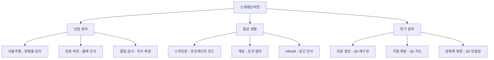

# 📚 스테레오비전 개념 정리 학습지

**작성일**: _________________ **학습자**: _________________

---

## 🎯 학습 목표 체크리스트

- [ ] 스테레오비전의 기본 원리 이해
- [ ] 시차(Disparity)와 깊이(Depth)의 관계 파악
- [ ] 스테레오 매칭 알고리즘의 특징 구분
- [ ] 카메라 매개변수의 역할 이해
- [ ] 실제 거리 계산 공식 활용

---

## 📖 1. 스테레오비전 기본 개념

### 1.1 정의와 원리

**스테레오비전(Stereo Vision)이란?**
> 인간의 **양안시**와 동일한 원리로, **두 개의 카메라**를 이용하여 3차원 공간 정보를 획득하는 컴퓨터 비전 기술

**핵심 원리 3단계**
```
1️⃣ 촬영: 두 카메라로 동일 장면을 서로 다른 위치에서 촬영
    ↓
2️⃣ 분석: 좌우 영상 간의 시차(Disparity) 정보 추출
    ↓
3️⃣ 계산: 삼각법을 이용하여 3차원 깊이 정보 계산
```

### 1.2 스테레오비전의 특징

| 구분 | 장점 ✅ | 단점 ❌ |
|------|---------|---------|
| **측정 범위** | 넓은 측정 범위 | 무한대 측정 불가 |
| **시스템 구성** | 간단한 하드웨어 | 정밀한 정렬 필요 |
| **비용** | 상대적으로 저렴 | 고품질 카메라 필요 |
| **처리 속도** | 실시간 처리 가능 | 계산량 많음 |
| **정확도** | 가까운 거리에서 높음 | 먼 거리에서 낮음 |
| **환경 의존성** | 다양한 환경 적용 | 조명, 텍스처 의존적 |

### 1.3 응용 분야 매핑



---

## 🧮 2. 수학적 원리와 공식

### 2.1 핵심 매개변수 정의

| 기호 | 명칭 | 단위 | 설명 |
|------|------|------|------|
| **f** | 초점거리 (Focal Length) | pixels | 카메라 렌즈의 초점거리 |
| **b** | 베이스라인 (Baseline) | meters | 두 카메라 중심 간의 거리 |
| **d** | 시차 (Disparity) | pixels | 좌우 영상에서 동일 점의 x좌표 차이 |
| **Z** | 깊이 (Depth) | meters | 카메라로부터 물체까지의 실제 거리 |

### 2.2 깊이 계산 공식 유도 과정

**Step 1: 기본 비례식 설정**
```
좌측 카메라: xl : f = (x + b/2) : Z
우측 카메라: xr : f = (x - b/2) : Z
```

**Step 2: 방정식으로 변환**
```
xl × Z = f × (x + b/2)  ... ①
xr × Z = f × (x - b/2)  ... ②
```

**Step 3: 두 식의 차이 계산**
```
①-② : (xl - xr) × Z = f × b
```

**Step 4: 최종 공식 도출**
```
Z = (f × b) / (xl - xr) = (f × b) / d
```

### 🔑 **핵심 공식**
```
깊이(Z) = (초점거리 × 베이스라인) / 시차
Z = (f × b) / d
```

### 2.3 공식의 의미와 특성

**📈 비례 관계**
- 시차 ↑ → 깊이 ↓ (가까운 물체)
- 시차 ↓ → 깊이 ↑ (먼 물체)

**🎯 정확도 관계**
- 베이스라인 ↑ → 정확도 ↑
- 초점거리 ↑ → 원거리 정확도 ↑

**⚠️ 주의사항**
- 시차가 0에 가까우면 → 깊이가 무한대로 발산
- 측정 오차는 거리의 제곱에 비례하여 증가

---

## 🔍 3. 스테레오 매칭 알고리즘

### 3.1 알고리즘 분류 체계

```
스테레오 매칭
├── 전역 정합 (Global Matching)
│   ├── Semi-Global Matching (SGM)
│   ├── Graph Cuts
│   ├── Belief Propagation
│   └── Dynamic Programming
│
└── 지역 정합 (Local Matching)
    ├── 영역 기반 (Area-based)
    │   ├── SAD (Sum of Absolute Differences)
    │   ├── SSD (Sum of Squared Differences)
    │   └── NCC (Normalized Cross Correlation)
    └── 특징 기반 (Feature-based)
        ├── Census Transform
        └── Rank Transform
```

### 3.2 주요 알고리즘 비교표

| 알고리즘 | 계산 속도 | 정확도 | 노이즈 강건성 | 조명 변화 대응 | 구현 난이도 |
|----------|-----------|--------|---------------|----------------|-------------|
| **SAD** | ⭐⭐⭐⭐⭐ | ⭐⭐⭐ | ⭐⭐ | ⭐⭐ | ⭐ |
| **SSD** | ⭐⭐⭐⭐ | ⭐⭐⭐ | ⭐⭐ | ⭐⭐ | ⭐ |
| **NCC** | ⭐⭐⭐ | ⭐⭐⭐⭐ | ⭐⭐⭐ | ⭐⭐⭐⭐ | ⭐⭐⭐ |
| **Census** | ⭐⭐ | ⭐⭐⭐⭐ | ⭐⭐⭐⭐⭐ | ⭐⭐⭐⭐⭐ | ⭐⭐⭐⭐ |
| **SGBM** | ⭐⭐ | ⭐⭐⭐⭐⭐ | ⭐⭐⭐⭐ | ⭐⭐⭐⭐ | ⭐⭐⭐⭐⭐ |

### 3.3 알고리즘별 수식 정리

**📊 SAD (Sum of Absolute Differences)**
```
SAD(x,y,d) = Σ|IL(x+i,y+j) - IR(x+i-d,y+j)|
```
- **특징**: 계산 간단, 빠른 처리
- **용도**: 실시간 시스템, 임베디드

**📈 SSD (Sum of Squared Differences)**
```
SSD(x,y,d) = Σ(IL(x+i,y+j) - IR(x+i-d,y+j))²
```
- **특징**: 큰 차이에 더 민감
- **용도**: 노이즈가 적은 환경

**🎭 Census Transform**
```
Census(x,y) = 중심 픽셀과 주변 픽셀 비교 → 비트 패턴 생성
Cost = Hamming Distance (XOR 연산 후 1의 개수)
```
- **특징**: 조명 변화에 강함
- **용도**: 야외 환경, 가변 조명

### 3.4 Winner-Takes-All 방법

**개념**: 각 픽셀에서 **최소 비용**을 가지는 시차를 선택
```python
best_disparity = argmin(cost_volume[y, x, :])
```

**과정**:
1. 모든 시차 후보에 대해 매칭 비용 계산
2. 비용 볼륨(Cost Volume) 생성: (height × width × disparity)
3. 각 픽셀에서 최소 비용의 시차 선택
4. 시차 맵 생성

---

## 🛠️ 4. 카메라 매개변수와 시스템 설계

### 4.1 카메라 내부 매개변수 (Intrinsic Parameters)

**카메라 매트릭스 (K Matrix)**
```
K = [fx  0  cx]
    [0  fy  cy]
    [0   0   1]
```

| 매개변수 | 의미 | 영향 |
|----------|------|------|
| **fx, fy** | x, y 방향 초점거리 | 시야각, 측정 범위 |
| **cx, cy** | 주점 (Principal Point) | 영상 중심점 |

### 4.2 카메라 외부 매개변수 (Extrinsic Parameters)

**회전 행렬 (R)과 이동 벡터 (t)**
- **회전 행렬**: 두 카메라 간의 회전 관계
- **이동 벡터**: 두 카메라 간의 이동 관계 (베이스라인 포함)

### 4.3 매개변수 설계 가이드

**🎯 목적별 매개변수 선택**

| 응용 분야 | 초점거리 | 베이스라인 | 특징 |
|-----------|----------|------------|------|
| **실내 로봇** | 중간 (400-600px) | 작음 (5-10cm) | 근거리 정밀도 |
| **자율주행** | 길게 (800-1200px) | 크게 (20-50cm) | 원거리 감지 |
| **모바일 AR** | 중간 (500-700px) | 제한적 (2-5cm) | 소형화 우선 |
| **산업 검사** | 맞춤형 | 정밀도 우선 | 고정밀 측정 |

**⚖️ 트레이드오프 관계**
```
초점거리 ↑ → 측정 범위 ↑, 시야각 ↓
베이스라인 ↑ → 정확도 ↑, 시스템 크기 ↑
해상도 ↑ → 정밀도 ↑, 처리 시간 ↑
```

---

## 💻 5. 실습 구현 핵심 코드

### 5.1 OpenCV 기본 구현

**StereoBM 사용**
```python
import cv2
import numpy as np

# 스테레오 매처 생성
stereo = cv2.StereoBM_create(
    numDisparities=64,  # 16의 배수
    blockSize=15        # 홀수
)

# 시차 계산
disparity = stereo.compute(imgL, imgR)
```

**StereoSGBM 사용 (고품질)**
```python
stereo = cv2.StereoSGBM_create(
    minDisparity=0,
    numDisparities=64,
    blockSize=5,
    P1=8 * 3 * 5**2,
    P2=32 * 3 * 5**2,
    uniquenessRatio=10,
    speckleWindowSize=100,
    speckleRange=32
)
```

### 5.2 깊이 계산 구현

```python
def disparity_to_depth(disparity, focal_length, baseline):
    \"\"\"시차를 깊이로 변환\"\"\"
    # 0으로 나누기 방지
    safe_disparity = np.where(disparity > 0, disparity, 0.1)
    
    # 깊이 계산: Z = (f * b) / d
    depth = (focal_length * baseline) / safe_disparity
    
    return depth
```

### 5.3 3D 점군 생성

```python
def create_3d_points(disparity, depth_calc):
    \"\"\"3D 점군 생성\"\"\"
    h, w = disparity.shape
    
    # 픽셀 좌표 생성
    y, x = np.mgrid[0:h, 0:w]
    
    # 깊이 계산
    z = disparity_to_depth(disparity, focal_length, baseline)
    
    # 3D 좌표 계산
    points_3d = np.zeros((h*w, 3))
    points_3d[:, 0] = ((x - cx) * z / f).flatten()  # X
    points_3d[:, 1] = ((y - cy) * z / f).flatten()  # Y
    points_3d[:, 2] = z.flatten()                    # Z
    
    return points_3d
```

---

## 📊 6. 성능 평가 및 최적화

### 6.1 성능 평가 지표

**정확도 지표**
- **절대 오차**: |측정값 - 실제값|
- **상대 오차**: |측정값 - 실제값| / 실제값 × 100%
- **RMSE**: √(Σ(측정값 - 실제값)²/n)

**커버리지 지표**
- **유효 픽셀 비율**: 측정 가능한 픽셀 / 전체 픽셀
- **깊이 범위**: 측정 가능한 최소/최대 거리

**처리 성능**
- **처리 시간**: 한 프레임 처리 소요 시간
- **FPS**: 초당 처리 가능한 프레임 수

### 6.2 최적화 전략

**🔧 매개변수 튜닝**
1. **numDisparities**: 측정 범위에 맞게 조정
2. **blockSize**: 텍스처에 따라 5-21 범위에서 선택
3. **uniquenessRatio**: 10-15로 설정하여 신뢰도 향상

**⚡ 처리 속도 개선**
1. **해상도 조정**: 필요한 정밀도에 맞게 축소
2. **관심 영역**: ROI 설정으로 처리 영역 제한
3. **GPU 활용**: CUDA 가속 알고리즘 사용

**🎨 품질 향상**
1. **전처리**: 히스토그램 평활화, 가우시안 블러
2. **후처리**: 중값 필터, 모폴로지 연산
3. **필터링**: 신뢰도 기반 픽셀 선별

---

## 🎯 7. 자가 진단 체크리스트

### 7.1 이론 이해도 점검

**기본 개념** (각 5점)
- [ ] 스테레오비전의 원리를 설명할 수 있다
- [ ] 시차와 깊이의 관계를 이해한다
- [ ] 핵심 공식 Z=(f×b)/d를 유도할 수 있다
- [ ] 카메라 매개변수의 역할을 안다

**알고리즘 이해** (각 5점)
- [ ] SAD, SSD의 차이점을 설명할 수 있다
- [ ] Census Transform의 특징을 안다
- [ ] 전역/지역 정합의 구분을 이해한다
- [ ] Winner-Takes-All 방법을 설명할 수 있다

**실무 적용** (각 5점)
- [ ] 매개변수 조정의 영향을 예측할 수 있다
- [ ] 응용 분야별 시스템 설계를 할 수 있다
- [ ] 성능 최적화 방법을 제시할 수 있다
- [ ] 오차 원인을 분석하고 해결할 수 있다

**총점**: ___/60점

### 7.2 실습 능력 점검

**코딩 능력**
- [ ] OpenCV로 기본 스테레오비전 구현
- [ ] 매개변수 조정 및 결과 분석
- [ ] 깊이 계산 함수 작성
- [ ] 3D 점군 생성 및 시각화

**문제 해결 능력**
- [ ] 시차 맵 품질 문제 진단
- [ ] 측정 오차 원인 분석
- [ ] 처리 속도 개선 방안 제시
- [ ] 실제 데이터 적용 시 발생하는 문제 해결

---

## 📝 8. 핵심 요약 카드

### 🔑 암기 필수 공식
```
🎯 깊이 공식: Z = (f × b) / d
📐 3D 변환: X = (x-cx)×Z/f, Y = (y-cy)×Z/f
📏 실제 크기: size = (pixel_size × distance) / f
⚖️ 정확도: 시차²에 반비례, 베이스라인에 비례
```

### 🎨 시각적 기억법
```
시차가 클수록 → 가까운 물체 → 높은 정확도 ✅
시차가 작을수록 → 먼 물체 → 낮은 정확도 ⚠️

베이스라인이 클수록 → 정확도 향상 ↗️
베이스라인이 작을수록 → 시스템 소형화 📱
```

### 🛠️ 알고리즘 선택 가이드
```
⚡ 속도 우선: SAD/SSD + StereoBM
🎨 품질 우선: SGBM + 후처리
🌅 야외 환경: Census Transform
🏭 실내 제어: SAD + 최적화
```

---

## 🚀 9. 다음 단계 학습 계획

### 9.1 단기 목표 (1-2주)
- [ ] 실제 스테레오 카메라 데이터로 실습
- [ ] 다양한 환경에서 매개변수 최적화
- [ ] 성능 벤치마킹 및 비교 분석
- [ ] 간단한 거리 측정 애플리케이션 개발

### 9.2 중기 목표 (1-2개월)
- [ ] 실시간 스테레오비전 시스템 구축
- [ ] 카메라 캘리브레이션 마스터
- [ ] 고급 후처리 기법 적용
- [ ] 모바일/임베디드 플랫폼 포팅

### 9.3 장기 목표 (3-6개월)
- [ ] 딥러닝 기반 스테레오 매칭 학습
- [ ] 다시점 스테레오 시스템 연구
- [ ] SLAM 기술과의 융합
- [ ] 상용 제품 개발 프로젝트 참여

---

## 💡 학습 팁 및 주의사항

### ✅ 효과적인 학습 방법
1. **이론과 실습의 균형**: 공식 이해 → 코드 구현 → 결과 분석
2. **매개변수 실험**: 다양한 설정으로 결과 변화 관찰
3. **시각적 분석**: 시차 맵, 깊이 맵을 통한 직관적 이해
4. **실제 데이터 적용**: 시뮬레이션에서 벗어나 현실 문제 해결

### ⚠️ 주의사항
1. **오버피팅 주의**: 특정 데이터에만 최적화하지 말 것
2. **단위 혼동 방지**: 픽셀, 미터, 밀리미터 단위 주의
3. **0으로 나누기**: 시차가 0인 경우 예외 처리 필수
4. **메모리 관리**: 대용량 이미지 처리 시 메모리 최적화
