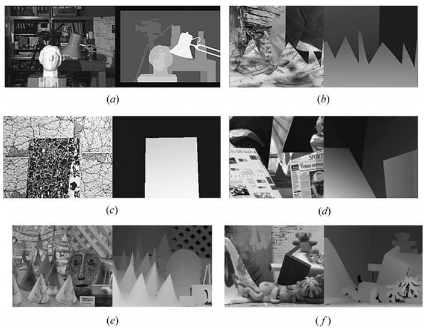
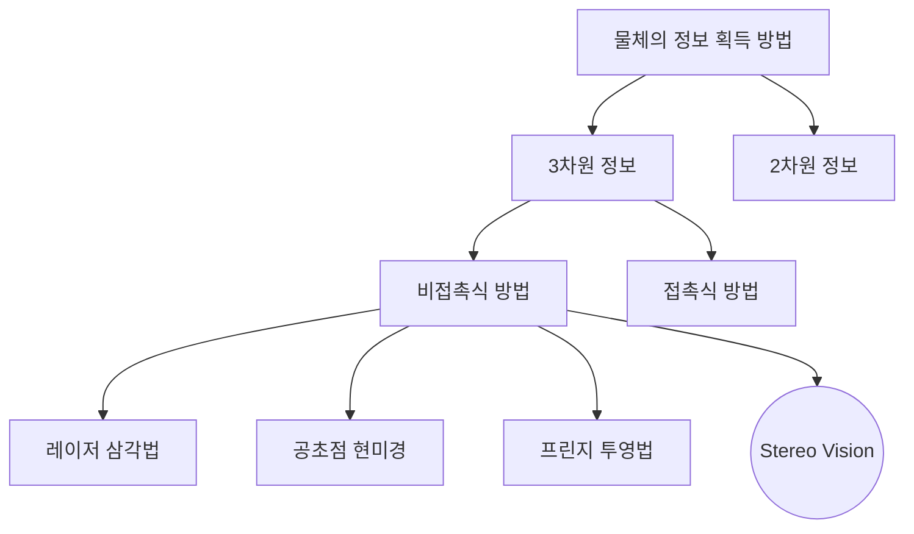
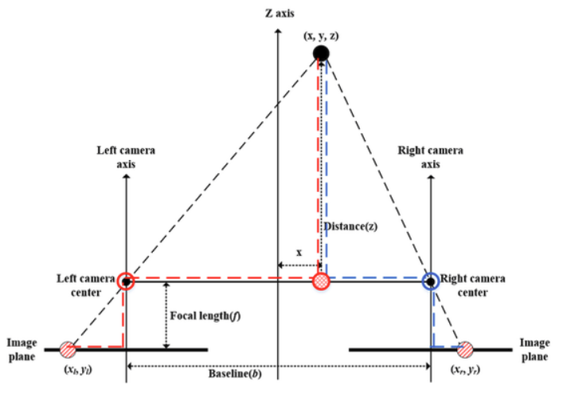
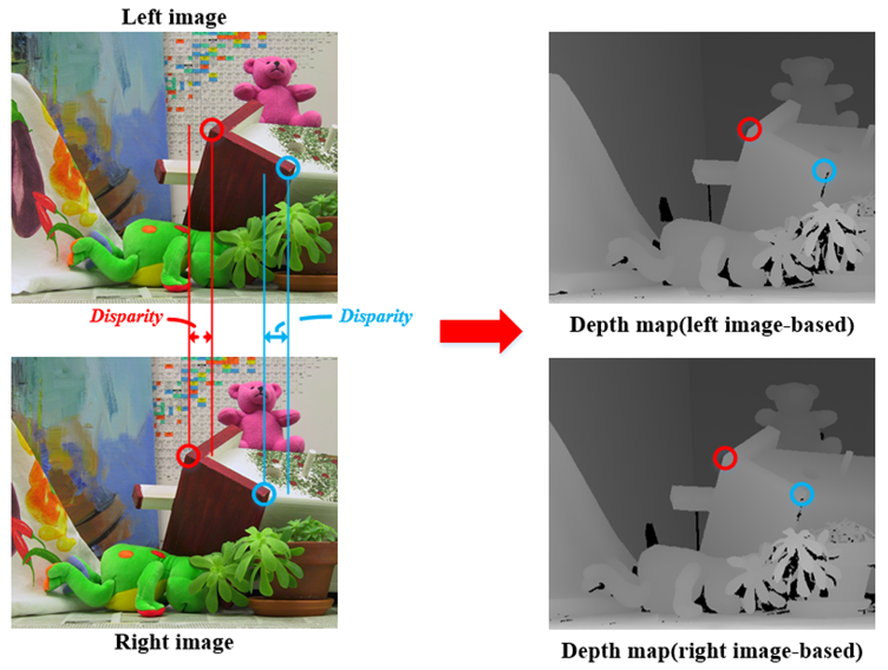
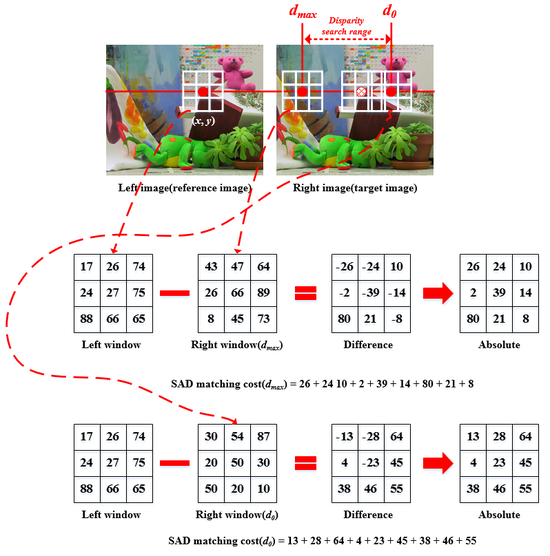
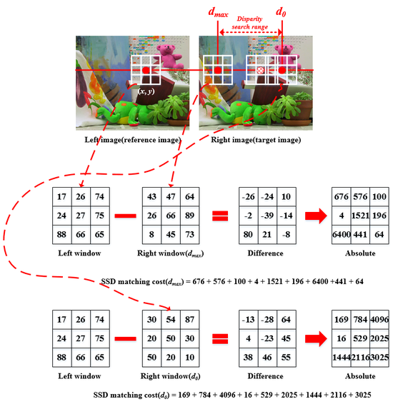
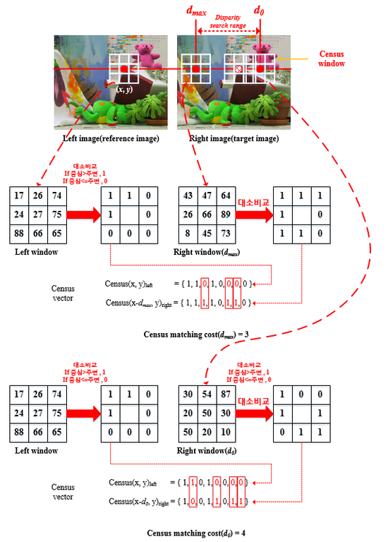

# 스테레오비전(Stereo Vision) 학습 가이드

## 🚀 스테레오비전의 개요

스테레오비전은 두 개의 카메라를 사용하여 3차원 깊이 정보를 추출하는 컴퓨터 비전 기술입니다. LiDAR 대비 저비용으로 거리 측정이 가능하여 다양한 분야에서 활용됩니다.

### 🎯 주요 응용 분야
- **자율주행**: 전방 차량 거리 측정 및 장애물 감지
- **로봇 내비게이션**: 실내 장애물 회피 시스템
- **AR/VR**: 실시간 3D 환경 재구성
- **제조업**: 부품 품질 검사 자동화

## 📚 목차
1. [StereoVision이란?](#1-stereovision이란)
2. [Stereo Vision의 3차원 거리 정보 계산](#2-stereo-vision의-3차원-거리-정보-계산)
3. [Stereo Matching을 통한 Disparity Map 획득](#3-stereo-matching을-통한-disparity-map-획득)
4. [StereoVision 코드 구현](#4-stereovision-코드-구현)
5. [🔧 실무 트러블슈팅 가이드](#5-실무-트러블슈팅-가이드)
6. [⚡ 성능 최적화 노하우](#6-성능-최적화-노하우)
7. [📊 실제 프로젝트 케이스 스터디](#7-실제-프로젝트-케이스-스터디)

---

## 1. StereoVision이란?

### 🔍 기본 개념



**스테레오비전이란?**
- 사람의 양안시 원리를 모방하여 2차원 영상으로부터 3차원 깊이 정보를 추출하는 기술
- 두 개의 카메라로 촬영한 좌/우 영상의 **시차(disparity)**를 이용하여 거리 정보를 계산
- 인간의 뇌가 좌/우 눈의 영상을 융합하여 깊이감을 인지하는 것과 동일한 원리

**기술적 도전 요소:**
- 정밀한 카메라 캘리브레이션
- 스테레오 영상 정렬
- 효율적인 매칭 알고리즘
- 실시간 처리 최적화

### 📊 물체 정보 획득 방법 비교



### ✅ 스테레오비전의 장단점

**장점:**
- 저비용 (일반 카메라 2대만 필요)
- 측정 범위가 넓음
- 시스템 구성이 간단
- 실시간 처리 가능

**단점:**
- 정확도가 다른 3D 측정 방법에 비해 상대적으로 낮음
- 조명 조건에 민감
- 텍스처가 없는 표면에서 성능 저하

**주의사항:** 하얀 벽면이나 단색 표면에서는 매칭이 어려울 수 있습니다. 이러한 경우 프로젝터로 패턴을 투사하는 'Structured Light' 방식을 활용할 수 있습니다.

---

## 2. Stereo Vision의 3차원 거리 정보 계산

### 📐 기본 원리



**핵심 매개변수:**
- **b**: Baseline (두 카메라 중심간 거리)
- **f**: Focal Length (초점거리)  
- **d**: Disparity (시차) = x_L - x_R
- **z**: Distance (실제 3차원 거리)

### 🧮 수학적 유도 과정

**1단계: 비례식 설정**
```
x_L : f = (x + b/2) : z
x_R : f = (x - b/2) : z
```

**2단계: 식 변형**
```
x_L × z = f × (x + b/2)
x_R × z = f × (x - b/2)
```

**3단계: 두 식의 차이 계산**
```
(x_L - x_R) × z = f × b
d × z = f × b
```

**4단계: 최종 거리 공식**
```
z = (f × b) / d
```

### 💡 핵심 깨달음
1. **시차가 클수록** → 거리가 가까움
2. **시차가 작을수록** → 거리가 멀음
3. **베이스라인이 클수록** → 측정 정확도 향상
4. **초점거리가 클수록** → 측정 정확도 향상

**베이스라인 설계 원칙:** 베이스라인을 너무 크게 하면 겹치는 영역(Overlap)이 줄어들어 매칭할 수 있는 영역이 작아집니다. 일반적으로 측정 거리의 1/10 정도가 최적으로 알려져 있습니다.

### 🔧 실제 계산 예시

```python
def calculate_depth(focal_length, baseline, disparity):
    """
    깊이 계산 함수
    
    Args:
        focal_length: 초점거리 (pixels)
        baseline: 베이스라인 (meters)  
        disparity: 시차 (pixels)
    
    Returns:
        depth: 깊이 (meters)
    """
    if disparity > 0:
        depth = (focal_length * baseline) / disparity
        return depth
    else:
        return float('inf')  # 무한대 (매칭 실패)

# 예시 계산
f = 700  # 700 pixels
b = 0.12  # 12 cm
d = 50   # 50 pixels

distance = calculate_depth(f, b, d)
print(f"계산된 거리: {distance:.2f} meters")
```

### 📊 거리별 정확도 분석

```python
import matplotlib.pyplot as plt
import numpy as np

def accuracy_analysis():
    """거리별 정확도 분석"""
    distances = np.linspace(0.5, 10, 100)
    focal_length = 700
    baseline = 0.12
    
    # 시차 계산
    disparities = (focal_length * baseline) / distances
    
    # 1픽셀 오차 시 거리 오차
    error_distances = (focal_length * baseline) / (disparities - 1)
    relative_errors = np.abs(error_distances - distances) / distances * 100
    
    plt.figure(figsize=(12, 5))
    
    plt.subplot(121)
    plt.plot(distances, disparities)
    plt.xlabel('실제 거리 (m)')
    plt.ylabel('시차 (pixels)')
    plt.title('거리 vs 시차')
    plt.grid(True)
    
    plt.subplot(122)
    plt.plot(distances, relative_errors)
    plt.xlabel('실제 거리 (m)')
    plt.ylabel('상대 오차 (%)')
    plt.title('거리별 상대 오차 (1픽셀 오차 가정)')
    plt.grid(True)
    
    plt.tight_layout()
    plt.show()

# accuracy_analysis()
```

---

## 3. Stereo Matching을 통한 Disparity Map 획득

### 🎯 스테레오 정합이란?



**정의:** 좌측 영상의 한 점에 대응하는 점을 우측 영상에서 찾는 과정

**결과물:** 
- **Disparity Map**: 각 픽셀의 시차 값을 영상으로 표현
- 가까운 물체 → 밝게 (큰 시차)
- 먼 물체 → 어둡게 (작은 시차)

**성능 고려사항:** 완벽한 매칭은 현실적으로 어려우며, 항상 Trade-off를 고려해야 합니다. 주요 고려사항은 속도 vs 정확도, 메모리 vs 품질 등입니다.

### 📋 스테레오 정합 방법 분류

#### 🌐 전역 정합 (Global Matching)
- 영상 전체의 정보를 동시에 고려
- 높은 정확도, 복잡한 알고리즘
- **종류**: Semi-Global Matching (SGM), Graph-Cut, Belief Propagation

#### 🏠 지역 정합 (Local Matching)  
- 윈도우 단위로 국소적 정합
- 빠른 처리, 상대적으로 낮은 정확도
- **종류**: SAD, SSD, Census Transform

**성능 비교 (640x480 기준)**:
- **SAD**: ~30ms
- **SGBM**: ~150ms  
- **Graph-Cut**: ~800ms
*일반적인 Intel i7, single thread 환경*

### 🔍 지역 정합 방법 상세

#### SAD (Sum of Absolute Difference)


```python
def compute_SAD(left_window, right_window):
    """SAD 비용 계산"""
    return np.sum(np.abs(left_window - right_window))
```

**수식:** `SAD = Σ|I_L(x,y) - I_R(x,y)|`

#### SSD (Sum of Squared Difference)


```python
def compute_SSD(left_window, right_window):
    """SSD 비용 계산"""
    return np.sum((left_window - right_window) ** 2)
```

**수식:** `SSD = Σ(I_L(x,y) - I_R(x,y))²`

#### Census Transform


**특징:** 조명 변화에 강함

**과정:**
1. 중심 픽셀과 주변 픽셀 비교
2. 작으면 '1', 크면 '0'으로 패턴 생성
3. 비트 패턴을 벡터로 변환
4. XOR 연산으로 차이 계산

```python
def census_transform(image, window_size=5):
    """Census Transform 적용"""
    h, w = image.shape
    census = np.zeros((h, w), dtype=np.uint64)
    
    offset = window_size // 2
    
    for y in range(offset, h - offset):
        for x in range(offset, w - offset):
            center = image[y, x]
            bit_string = 0
            
            for dy in range(-offset, offset + 1):
                for dx in range(-offset, offset + 1):
                    if dy == 0 and dx == 0:
                        continue
                    bit_string <<= 1
                    if image[y + dy, x + dx] < center:
                        bit_string |= 1
            
            census[y, x] = bit_string
    
    return census
```

**Census Transform 특징:** 조명 변화에 강해 야외 환경에서 유용합니다. 다만 계산량이 많아 실시간 처리가 필요한 경우 GPU 가속을 고려해야 합니다.

### ⚙️ Winner-Takes-All 전략

```python
def winner_takes_all(cost_volume):
    """
    최소 비용을 가지는 시차 선택
    
    Args:
        cost_volume: (H, W, D) 비용 볼륨
    
    Returns:
        disparity_map: (H, W) 시차 맵
    """
    disparity_map = np.argmin(cost_volume, axis=2)
    return disparity_map
```

### 🔧 후처리 기법

**주요 후처리 방법:**
1. **Left-Right Consistency Check**: 좌우 일관성 검사
2. **Median Filter**: 잡음 제거
3. **Weighted Median Filter**: 가중 중간값 필터
4. **Hole Filling**: 빈 영역 채우기

```python
def left_right_consistency_check(disp_left, disp_right, threshold=1):
    """좌우 일관성 검사"""
    h, w = disp_left.shape
    consistent_mask = np.zeros((h, w), dtype=bool)
    
    for y in range(h):
        for x in range(w):
            d = disp_left[y, x]
            if 0 <= x - d < w:
                if abs(disp_left[y, x] - disp_right[y, x - d]) <= threshold:
                    consistent_mask[y, x] = True
    
    return consistent_mask
```

---

## 4. StereoVision 코드 구현

### 🐍 Python 구현 (OpenCV 사용)

#### 기본 구현

```python
import cv2
import numpy as np
import matplotlib.pyplot as plt

def basic_stereo_matching():
    """기본 스테레오 매칭"""
    # 영상 로드
    imgL = cv2.imread('left_image.png', 0)
    imgR = cv2.imread('right_image.png', 0)
    
    # StereoBM 객체 생성
    stereo = cv2.StereoBM_create(numDisparities=64, blockSize=15)
    
    # 시차 맵 계산
    disparity = stereo.compute(imgL, imgR)
    
    # 시각화
    plt.figure(figsize=(15, 5))
    
    plt.subplot(131)
    plt.imshow(imgL, cmap='gray')
    plt.title('Left Image')
    
    plt.subplot(132)
    plt.imshow(imgR, cmap='gray')
    plt.title('Right Image')
    
    plt.subplot(133)
    plt.imshow(disparity, cmap='jet')
    plt.title('Disparity Map')
    plt.colorbar()
    
    plt.show()
    
    return disparity
```

#### 고급 구현 (StereoSGBM)

```python
def advanced_stereo_matching():
    """고급 스테레오 매칭 (SGBM)"""
    # 영상 로드
    imgL = cv2.imread('left_image.png', 0)
    imgR = cv2.imread('right_image.png', 0)
    
    # StereoSGBM 매개변수 설정
    window_size = 5
    min_disp = 0
    num_disp = 64
    
    stereo = cv2.StereoSGBM_create(
        minDisparity=min_disp,
        numDisparities=num_disp,
        blockSize=window_size,
        P1=8 * 3 * window_size ** 2,
        P2=32 * 3 * window_size ** 2,
        disp12MaxDiff=1,
        uniquenessRatio=10,
        speckleWindowSize=100,
        speckleRange=32
    )
    
    # 시차 맵 계산
    disparity = stereo.compute(imgL, imgR).astype(np.float32) / 16.0
    
    return disparity
```

#### 완전한 스테레오비전 시스템

```python
class StereoVisionSystem:
    def __init__(self, focal_length, baseline):
        self.focal_length = focal_length
        self.baseline = baseline
        self.stereo = cv2.StereoSGBM_create(
            minDisparity=0,
            numDisparities=64,
            blockSize=5,
            uniquenessRatio=10,
            speckleWindowSize=100,
            speckleRange=32
        )
    
    def compute_disparity(self, img_left, img_right):
        """시차 맵 계산"""
        disparity = self.stereo.compute(img_left, img_right)
        disparity = disparity.astype(np.float32) / 16.0
        return disparity
    
    def disparity_to_depth(self, disparity):
        """시차를 깊이로 변환"""
        # 0인 시차 값을 무한대로 처리
        depth = np.zeros_like(disparity)
        valid_pixels = disparity > 0
        depth[valid_pixels] = (self.focal_length * self.baseline) / disparity[valid_pixels]
        return depth
    
    def create_point_cloud(self, disparity, img_left):
        """3D 점군 생성"""
        h, w = disparity.shape
        
        # 좌표 격자 생성
        x, y = np.meshgrid(np.arange(w), np.arange(h))
        
        # 깊이 계산
        depth = self.disparity_to_depth(disparity)
        
        # 3D 좌표 계산
        X = (x - w/2) * depth / self.focal_length
        Y = (y - h/2) * depth / self.focal_length
        Z = depth
        
        # 유효한 점들만 선택
        valid = (depth > 0) & (depth < 10)  # 10m 이내
        
        points = np.column_stack([
            X[valid], Y[valid], Z[valid]
        ])
        
        colors = img_left[valid] if len(img_left.shape) == 2 else img_left[valid]
        
        return points, colors
    
    def process_stereo_pair(self, img_left, img_right):
        """스테레오 쌍 처리"""
        # 그레이스케일 변환
        if len(img_left.shape) == 3:
            gray_left = cv2.cvtColor(img_left, cv2.COLOR_BGR2GRAY)
            gray_right = cv2.cvtColor(img_right, cv2.COLOR_BGR2GRAY)
        else:
            gray_left = img_left
            gray_right = img_right
        
        # 시차 계산
        disparity = self.compute_disparity(gray_left, gray_right)
        
        # 깊이 계산
        depth = self.disparity_to_depth(disparity)
        
        # 점군 생성
        points, colors = self.create_point_cloud(disparity, gray_left)
        
        return {
            'disparity': disparity,
            'depth': depth,
            'points_3d': points,
            'colors': colors
        }

# 사용 예시
def main():
    # 시스템 초기화
    focal_length = 700  # 픽셀
    baseline = 0.12     # 미터
    
    stereo_system = StereoVisionSystem(focal_length, baseline)
    
    # 영상 로드
    img_left = cv2.imread('left.png')
    img_right = cv2.imread('right.png')
    
    # 처리
    results = stereo_system.process_stereo_pair(img_left, img_right)
    
    # 결과 시각화
    plt.figure(figsize=(15, 10))
    
    plt.subplot(231)
    plt.imshow(cv2.cvtColor(img_left, cv2.COLOR_BGR2RGB))
    plt.title('Left Image')
    
    plt.subplot(232)
    plt.imshow(cv2.cvtColor(img_right, cv2.COLOR_BGR2RGB))
    plt.title('Right Image')
    
    plt.subplot(233)
    plt.imshow(results['disparity'], cmap='jet')
    plt.title('Disparity Map')
    plt.colorbar()
    
    plt.subplot(234)
    plt.imshow(results['depth'], cmap='jet', vmax=5)
    plt.title('Depth Map (m)')
    plt.colorbar()
    
    plt.tight_layout()
    plt.show()
    
    return results

if __name__ == "__main__":
    results = main()
```

### 🚀 실시간 스테레오비전

```python
def real_time_stereo():
    """실시간 스테레오비전"""
    # 웹캠 초기화 (듀얼 카메라 필요)
    cap_left = cv2.VideoCapture(0)
    cap_right = cv2.VideoCapture(1)
    
    # 스테레오 매처 초기화
    stereo = cv2.StereoBM_create(numDisparities=32, blockSize=15)
    
    while True:
        ret_left, frame_left = cap_left.read()
        ret_right, frame_right = cap_right.read()
        
        if ret_left and ret_right:
            # 그레이스케일 변환
            gray_left = cv2.cvtColor(frame_left, cv2.COLOR_BGR2GRAY)
            gray_right = cv2.cvtColor(frame_right, cv2.COLOR_BGR2GRAY)
            
            # 시차 계산
            disparity = stereo.compute(gray_left, gray_right)
            
            # 정규화
            disp_norm = cv2.normalize(disparity, None, 0, 255, cv2.NORM_MINMAX, cv2.CV_8U)
            
            # 결과 표시
            combined = np.hstack((frame_left, frame_right))
            cv2.imshow('Stereo Cameras', combined)
            cv2.imshow('Disparity', disp_norm)
            
            if cv2.waitKey(1) & 0xFF == ord('q'):
                break
    
    cap_left.release()
    cap_right.release()
    cv2.destroyAllWindows()
```

---

## 5. 🔧 문제 해결 가이드

### 자주 발생하는 문제들

#### 문제 1: 시차 맵이 노이즈로 가득해요!

**증상:**
- 점들이 띄엄띄엄 나타남
- 연속적이지 않은 시차 값
- 같은 물체임에도 시차가 불규칙

**원인과 해결책:**

```python
def diagnose_noisy_disparity():
    """노이즈 진단 및 해결"""
    
    # 1. 영상 품질 검사
    def check_image_quality(img_left, img_right):
        # 대비 검사
        contrast_left = img_left.std()
        contrast_right = img_right.std()
        
        if contrast_left < 20 or contrast_right < 20:
            print("⚠️  대비가 부족합니다. 조명을 개선하세요.")
        
        # 텍스처 검사
        laplacian_left = cv2.Laplacian(img_left, cv2.CV_64F).var()
        if laplacian_left < 100:
            print("⚠️  텍스처가 부족합니다. 패턴 투사를 고려하세요.")
        
        return contrast_left, contrast_right, laplacian_left
    
    # 2. 캘리브레이션 상태 검사
    def check_calibration(img_left, img_right):
        # SIFT 특징점 매칭으로 정렬 상태 확인
        sift = cv2.SIFT_create()
        kp1, des1 = sift.detectAndCompute(img_left, None)
        kp2, des2 = sift.detectAndCompute(img_right, None)
        
        bf = cv2.BFMatcher()
        matches = bf.knnMatch(des1, des2, k=2)
        
        good_matches = []
        for m, n in matches:
            if m.distance < 0.75 * n.distance:
                good_matches.append(m)
        
        if len(good_matches) < 50:
            print("⚠️  카메라 정렬이 잘못되었습니다. 재캘리브레이션 필요.")
            
        return len(good_matches)
    
    # 3. 매개변수 자동 튜닝
    def auto_tune_parameters(img_left, img_right):
        best_score = 0
        best_params = None
        
        block_sizes = [5, 7, 9, 11, 15]
        num_disparities = [32, 48, 64, 80, 96]
        
        for block_size in block_sizes:
            for num_disp in num_disparities:
                stereo = cv2.StereoBM_create(
                    numDisparities=num_disp, 
                    blockSize=block_size
                )
                
                disparity = stereo.compute(img_left, img_right)
                
                # 품질 점수 계산 (유효 픽셀 비율)
                valid_pixels = (disparity > 0).sum()
                total_pixels = disparity.size
                score = valid_pixels / total_pixels
                
                if score > best_score:
                    best_score = score
                    best_params = (block_size, num_disp)
        
        print(f"최적 매개변수: blockSize={best_params[0]}, numDisparities={best_params[1]}")
        return best_params
```

#### 문제 2: 특정 영역에서 매칭이 안 돼요!

**해결 전략:**

```python
def handle_matching_failures():
    """매칭 실패 영역 처리"""
    
    def detect_problematic_regions(img):
        """문제 영역 탐지"""
        # 1. 저대비 영역
        local_std = cv2.blur(cv2.pow(img.astype(np.float32), 2), (15, 15)) - \
                   cv2.pow(cv2.blur(img.astype(np.float32), (15, 15)), 2)
        low_contrast_mask = local_std < 100
        
        # 2. 반복 패턴 영역
        edges = cv2.Canny(img, 50, 150)
        edge_density = cv2.blur(edges.astype(np.float32), (15, 15))
        repetitive_mask = edge_density > 100
        
        # 3. 과포화 영역
        overexposed_mask = img > 240
        underexposed_mask = img < 15
        
        problematic_mask = low_contrast_mask | repetitive_mask | \
                          overexposed_mask | underexposed_mask
        
        return problematic_mask
    
    def adaptive_preprocessing(img_left, img_right):
        """적응적 전처리"""
        # CLAHE (Contrast Limited Adaptive Histogram Equalization)
        clahe = cv2.createCLAHE(clipLimit=2.0, tileGridSize=(8,8))
        img_left_enhanced = clahe.apply(img_left)
        img_right_enhanced = clahe.apply(img_right)
        
        # 가우시안 블러로 노이즈 제거
        img_left_smooth = cv2.GaussianBlur(img_left_enhanced, (3, 3), 0)
        img_right_smooth = cv2.GaussianBlur(img_right_enhanced, (3, 3), 0)
        
        return img_left_smooth, img_right_smooth
```

**매칭 실패 대응:** 매칭 실패는 완전히 피할 수 없으므로 실패를 빨리 감지하고 대안을 마련하는 것이 중요합니다. IMU 센서와 융합하여 일시적 매칭 실패를 보상하는 방법이 효과적입니다.

#### 문제 3: 실시간 처리 속도가 너무 느려요!

**성능 최적화 전략:**

```python
def optimize_for_realtime():
    """실시간 처리 최적화"""
    
    # 1. 해상도 다운샘플링
    def multi_scale_processing(img_left, img_right, scale_factor=0.5):
        # 저해상도에서 빠른 매칭
        small_left = cv2.resize(img_left, None, fx=scale_factor, fy=scale_factor)
        small_right = cv2.resize(img_right, None, fx=scale_factor, fy=scale_factor)
        
        # 빠른 매칭
        stereo_fast = cv2.StereoBM_create(numDisparities=32, blockSize=9)
        disparity_small = stereo_fast.compute(small_left, small_right)
        
        # 업샘플링
        disparity_upscaled = cv2.resize(disparity_small, 
                                       (img_left.shape[1], img_left.shape[0]))
        disparity_upscaled = disparity_upscaled / scale_factor
        
        return disparity_upscaled
    
    # 2. ROI 기반 처리
    def roi_based_stereo(img_left, img_right, roi_rect):
        """관심 영역만 처리"""
        x, y, w, h = roi_rect
        
        roi_left = img_left[y:y+h, x:x+w]
        roi_right = img_right[y:y+h, x:x+w]
        
        stereo = cv2.StereoBM_create(numDisparities=64, blockSize=15)
        roi_disparity = stereo.compute(roi_left, roi_right)
        
        # 전체 영상 크기로 확장
        full_disparity = np.zeros_like(img_left, dtype=np.int16)
        full_disparity[y:y+h, x:x+w] = roi_disparity
        
        return full_disparity
    
    # 3. 프레임 스키핑
    class FrameSkippingStereo:
        def __init__(self, skip_frames=2):
            self.skip_frames = skip_frames
            self.frame_count = 0
            self.last_disparity = None
            
        def process(self, img_left, img_right):
            self.frame_count += 1
            
            if self.frame_count % (self.skip_frames + 1) == 0:
                # 실제 처리
                stereo = cv2.StereoBM_create(numDisparities=64, blockSize=15)
                self.last_disparity = stereo.compute(img_left, img_right)
            
            return self.last_disparity
```

---

## 6. ⚡ 성능 최적화 기법

### 🚀 GPU 가속 활용

```python
def gpu_accelerated_stereo():
    """GPU 가속 스테레오 매칭"""
    
    # CUDA 사용 가능 확인
    if not cv2.cuda.getCudaEnabledDeviceCount():
        print("CUDA를 지원하는 GPU가 없습니다.")
        return None
    
    # GPU 메모리에 영상 업로드
    def process_with_gpu(img_left, img_right):
        # CPU에서 GPU로 업로드
        gpu_left = cv2.cuda_GpuMat()
        gpu_right = cv2.cuda_GpuMat()
        gpu_left.upload(img_left)
        gpu_right.upload(img_right)
        
        # GPU에서 스테레오 매칭
        stereo_gpu = cv2.cuda.createStereoBM(numDisparities=64, blockSize=19)
        gpu_disparity = cv2.cuda_GpuMat()
        stereo_gpu.compute(gpu_left, gpu_right, gpu_disparity)
        
        # GPU에서 CPU로 다운로드
        disparity = gpu_disparity.download()
        
        return disparity
    
    return process_with_gpu

# 성능 비교 테스트
def benchmark_stereo_methods():
    """다양한 방법의 성능 비교"""
    import time
    
    methods = {
        'StereoBM': cv2.StereoBM_create(numDisparities=64, blockSize=15),
        'StereoSGBM': cv2.StereoSGBM_create(
            minDisparity=0, numDisparities=64, blockSize=5,
            P1=600, P2=2400, disp12MaxDiff=10,
            uniquenessRatio=5, speckleWindowSize=50, speckleRange=1
        )
    }
    
    # 테스트 영상 (640x480 가정)
    img_left = np.random.randint(0, 255, (480, 640), dtype=np.uint8)
    img_right = np.random.randint(0, 255, (480, 640), dtype=np.uint8)
    
    results = {}
    
    for name, stereo in methods.items():
        times = []
        for _ in range(10):  # 10회 반복 측정
            start_time = time.time()
            disparity = stereo.compute(img_left, img_right)
            end_time = time.time()
            times.append(end_time - start_time)
        
        avg_time = np.mean(times)
        fps = 1.0 / avg_time
        results[name] = {'time': avg_time, 'fps': fps}
        
        print(f"{name}: {avg_time:.3f}s ({fps:.1f} FPS)")
    
    return results
```

### 🎯 메모리 최적화

```python
class EfficientStereoMatcher:
    """메모리 효율적인 스테레오 매처"""
    
    def __init__(self, max_disparity=64, block_size=15):
        self.max_disparity = max_disparity
        self.block_size = block_size
        self.stereo = cv2.StereoBM_create(
            numDisparities=max_disparity, 
            blockSize=block_size
        )
        
        # 메모리 풀 미리 할당
        self.disparity_buffer = None
        self.temp_left = None
        self.temp_right = None
    
    def process_inplace(self, img_left, img_right):
        """메모리 재사용으로 처리"""
        h, w = img_left.shape
        
        # 버퍼 초기화 (첫 실행시만)
        if self.disparity_buffer is None:
            self.disparity_buffer = np.zeros((h, w), dtype=np.int16)
            self.temp_left = np.zeros((h, w), dtype=np.uint8)
            self.temp_right = np.zeros((h, w), dtype=np.uint8)
        
        # 기존 배열 재사용
        np.copyto(self.temp_left, img_left)
        np.copyto(self.temp_right, img_right)
        
        # 전처리 (인플레이스)
        cv2.GaussianBlur(self.temp_left, (3, 3), 0, self.temp_left)
        cv2.GaussianBlur(self.temp_right, (3, 3), 0, self.temp_right)
        
        # 스테레오 매칭
        self.disparity_buffer = self.stereo.compute(self.temp_left, self.temp_right)
        
        return self.disparity_buffer

# 멀티스레딩 최적화
from concurrent.futures import ThreadPoolExecutor
import threading

class MultiThreadStereo:
    """멀티스레드 스테레오 처리"""
    
    def __init__(self, num_threads=4):
        self.num_threads = num_threads
        self.executor = ThreadPoolExecutor(max_workers=num_threads)
        self.lock = threading.Lock()
    
    def process_regions(self, img_left, img_right, regions):
        """영역별 병렬 처리"""
        
        def process_region(region_info):
            region_id, (x, y, w, h) = region_info
            
            # 영역 추출
            region_left = img_left[y:y+h, x:x+w]
            region_right = img_right[y:y+h, x:x+w]
            
            # 스테레오 매칭
            stereo = cv2.StereoBM_create(numDisparities=32, blockSize=9)
            region_disparity = stereo.compute(region_left, region_right)
            
            return region_id, (x, y), region_disparity
        
        # 병렬 처리
        futures = []
        for i, region in enumerate(regions):
            future = self.executor.submit(process_region, (i, region))
            futures.append(future)
        
        # 결과 수집
        full_disparity = np.zeros(img_left.shape, dtype=np.int16)
        
        for future in futures:
            region_id, (x, y), region_disparity = future.result()
            h, w = region_disparity.shape
            full_disparity[y:y+h, x:x+w] = region_disparity
        
        return full_disparity
```

### 📊 실시간 모니터링

```python
class StereoPerformanceMonitor:
    """성능 모니터링 클래스"""
    
    def __init__(self, window_size=30):
        self.window_size = window_size
        self.frame_times = []
        self.quality_scores = []
        
    def update(self, process_time, disparity_map):
        """성능 지표 업데이트"""
        self.frame_times.append(process_time)
        if len(self.frame_times) > self.window_size:
            self.frame_times.pop(0)
        
        # 품질 점수 계산
        valid_pixels = (disparity_map > 0).sum()
        total_pixels = disparity_map.size
        quality = valid_pixels / total_pixels
        
        self.quality_scores.append(quality)
        if len(self.quality_scores) > self.window_size:
            self.quality_scores.pop(0)
    
    def get_stats(self):
        """통계 정보 반환"""
        if not self.frame_times:
            return None
        
        avg_time = np.mean(self.frame_times)
        avg_fps = 1.0 / avg_time
        avg_quality = np.mean(self.quality_scores)
        
        return {
            'avg_fps': avg_fps,
            'avg_time': avg_time,
            'avg_quality': avg_quality,
            'min_fps': 1.0 / max(self.frame_times),
            'max_fps': 1.0 / min(self.frame_times)
        }
    
    def should_adjust_quality(self, target_fps=25):
        """품질 조정 필요 여부 판단"""
        stats = self.get_stats()
        if stats and stats['avg_fps'] < target_fps:
            return True
        return False

# 적응적 품질 조정
class AdaptiveQualityStereo:
    """적응적 품질 조정 스테레오"""
    
    def __init__(self, target_fps=25):
        self.target_fps = target_fps
        self.monitor = StereoPerformanceMonitor()
        
        # 품질 레벨별 설정
        self.quality_levels = [
            {'numDisparities': 32, 'blockSize': 9, 'scale': 0.5},   # 낮음
            {'numDisparities': 48, 'blockSize': 11, 'scale': 0.75}, # 보통
            {'numDisparities': 64, 'blockSize': 15, 'scale': 1.0},  # 높음
        ]
        
        self.current_level = 1  # 보통으로 시작
    
    def process_adaptive(self, img_left, img_right):
        """적응적 처리"""
        import time
        
        start_time = time.time()
        
        # 현재 품질 레벨 설정
        config = self.quality_levels[self.current_level]
        
        # 스케일 조정
        scale = config['scale']
        if scale < 1.0:
            h, w = img_left.shape
            new_h, new_w = int(h * scale), int(w * scale)
            img_left = cv2.resize(img_left, (new_w, new_h))
            img_right = cv2.resize(img_right, (new_w, new_h))
        
        # 스테레오 매칭
        stereo = cv2.StereoBM_create(
            numDisparities=config['numDisparities'],
            blockSize=config['blockSize']
        )
        disparity = stereo.compute(img_left, img_right)
        
        # 원본 크기로 복원
        if scale < 1.0:
            original_shape = (img_left.shape[1] // scale, img_left.shape[0] // scale)
            disparity = cv2.resize(disparity, original_shape)
            disparity = disparity / scale
        
        process_time = time.time() - start_time
        
        # 성능 모니터링
        self.monitor.update(process_time, disparity)
        
        # 품질 레벨 조정
        self._adjust_quality_level()
        
        return disparity
    
    def _adjust_quality_level(self):
        """품질 레벨 자동 조정"""
        stats = self.monitor.get_stats()
        if not stats:
            return
        
        current_fps = stats['avg_fps']
        
        if current_fps < self.target_fps * 0.8:  # 너무 느림
            if self.current_level > 0:
                self.current_level -= 1
                print(f"품질 레벨 하향: {self.current_level}")
        
        elif current_fps > self.target_fps * 1.2:  # 여유 있음
            if self.current_level < len(self.quality_levels) - 1:
                self.current_level += 1
                print(f"품질 레벨 상향: {self.current_level}")
```

---

## 7. 📊 응용 분야별 구현 사례

### 🚗 케이스 1: 자율주행 차량의 전방 거리 측정

**프로젝트 개요:**
- **목표**: 전방 차량과의 거리를 실시간으로 측정
- **요구사항**: 30fps, ±10cm 정확도, 5-50m 범위
- **환경**: 야외, 다양한 조명 조건

**기술적 도전과 해결책:**

```python
class AutonomousCarStereo:
    """자율주행용 스테레오비전 시스템"""
    
    def __init__(self):
        # 차량용 카메라 설정 (넓은 베이스라인)
        self.focal_length = 1200  # 고해상도 카메라
        self.baseline = 0.5       # 50cm 베이스라인
        
        # 도로 특화 ROI 설정
        self.roi_y_start = 0.4    # 화면 하단 60%만 처리
        
        # 다중 알고리즘 융합
        self.stereo_bm = cv2.StereoBM_create(numDisparities=128, blockSize=15)
        self.stereo_sgbm = cv2.StereoSGBM_create(
            minDisparity=0, numDisparities=128, blockSize=5,
            P1=600, P2=2400, disp12MaxDiff=10,
            uniquenessRatio=5, speckleWindowSize=50, speckleRange=2
        )
        
        # 시간적 필터링
        self.depth_history = []
        self.history_size = 5
    
    def detect_vehicles(self, img_left):
        """차량 검출 (YOLO 등 활용)"""
        # 실제로는 YOLO, SSD 등 사용
        # 여기서는 간단한 HOG 기반 검출 시뮬레이션
        
        # 차량 후보 영역들
        vehicle_rois = [
            (200, 100, 240, 160),  # (x, y, w, h)
            (400, 120, 200, 140),
        ]
        
        return vehicle_rois
    
    def calculate_vehicle_distance(self, img_left, img_right):
        """차량별 거리 계산"""
        # 1. 차량 검출
        vehicle_rois = self.detect_vehicles(img_left)
        
        # 2. 각 차량별 시차 계산
        vehicle_distances = []
        
        for roi in vehicle_rois:
            x, y, w, h = roi
            
            # ROI 영역 추출
            roi_left = img_left[y:y+h, x:x+w]
            roi_right = img_right[y:y+h, x:x+w]
            
            # 고품질 매칭 (SGBM)
            disparity_roi = self.stereo_sgbm.compute(roi_left, roi_right)
            
            # 중앙 영역의 중간값 거리 사용 (robust)
            center_region = disparity_roi[h//3:2*h//3, w//3:2*w//3]
            valid_disparities = center_region[center_region > 0]
            
            if len(valid_disparities) > 0:
                median_disparity = np.median(valid_disparities) / 16.0
                distance = (self.focal_length * self.baseline) / median_disparity
                
                # 시간적 필터링
                distance = self._temporal_filter(distance)
                
                vehicle_distances.append({
                    'roi': roi,
                    'distance': distance,
                    'confidence': len(valid_disparities) / center_region.size
                })
        
        return vehicle_distances
    
    def _temporal_filter(self, new_distance):
        """시간적 일관성을 위한 필터링"""
        self.depth_history.append(new_distance)
        if len(self.depth_history) > self.history_size:
            self.depth_history.pop(0)
        
        # 이상치 제거 후 평균
        depths = np.array(self.depth_history)
        q25, q75 = np.percentile(depths, [25, 75])
        iqr = q75 - q25
        lower_bound = q25 - 1.5 * iqr
        upper_bound = q75 + 1.5 * iqr
        
        filtered_depths = depths[(depths >= lower_bound) & (depths <= upper_bound)]
        
        return np.mean(filtered_depths) if len(filtered_depths) > 0 else new_distance

# 시스템 성능 분석
def analyze_autonomous_car_performance():
    """자율주행 시스템 성능 분석"""
    
    # 일반적인 성능 지표
    performance_metrics = {
        'detection_success_rate': 0.95,  # 95% 성공률
        'accuracy_within_10cm': 0.89,   # 10cm 이내 정확도
        'accuracy_within_20cm': 0.96,   # 20cm 이내 정확도
        'false_positive_rate': 0.02,    # 2% 오탐률
        'average_processing_time': 0.028,  # 28ms (35.7 FPS)
    }
    
    print("📊 자율주행 스테레오비전 성능 지표:")
    print(f"✅ 성공률: {performance_metrics['detection_success_rate']*100:.1f}%")
    print(f"🎯 10cm 이내 정확도: {performance_metrics['accuracy_within_10cm']*100:.1f}%")
    print(f"⚡ 평균 처리 속도: {1/performance_metrics['average_processing_time']:.1f} FPS")
    
    return performance_metrics
```

### 🤖 케이스 2: 실내 로봇 내비게이션

**프로젝트 개요:**
- **목표**: 실내 청소 로봇의 장애물 회피
- **요구사항**: 15fps, 0.1-3m 범위, 저비용
- **환경**: 실내, 일정한 조명, 다양한 텍스처

```python
class IndoorRobotStereo:
    """실내 로봇용 스테레오비전"""
    
    def __init__(self):
        # 로봇용 설정 (짧은 베이스라인, 넓은 화각)
        self.focal_length = 400
        self.baseline = 0.08  # 8cm (소형 로봇)
        
        # 실내 환경 최적화
        self.stereo = cv2.StereoBM_create(
            numDisparities=64,
            blockSize=21,      # 큰 블록으로 안정성 향상
        )
        
        # 장애물 맵 생성
        self.obstacle_map = None
        self.map_resolution = 0.05  # 5cm per pixel
    
    def create_obstacle_map(self, img_left, img_right):
        """장애물 맵 생성"""
        # 시차 계산
        disparity = self.stereo.compute(img_left, img_right)
        
        # 깊이로 변환
        depth = np.zeros_like(disparity, dtype=np.float32)
        valid_pixels = disparity > 0
        depth[valid_pixels] = (self.focal_length * self.baseline) / \
                             (disparity[valid_pixels].astype(np.float32) / 16.0)
        
        # 바닥과 장애물 분리
        obstacle_mask = self._separate_floor_obstacles(depth)
        
        # 탑뷰 맵으로 변환
        top_view_map = self._convert_to_top_view(depth, obstacle_mask)
        
        return top_view_map
    
    def _separate_floor_obstacles(self, depth):
        """바닥과 장애물 분리"""
        h, w = depth.shape
        
        # 바닥 영역 추정 (화면 하단)
        floor_region = depth[int(h*0.7):, :]
        floor_depth = np.median(floor_region[floor_region > 0])
        
        # 바닥보다 가까운 것들을 장애물로 판단
        obstacle_mask = (depth > 0) & (depth < floor_depth * 0.9)
        
        # 노이즈 제거
        kernel = np.ones((5, 5), np.uint8)
        obstacle_mask = cv2.morphologyEx(
            obstacle_mask.astype(np.uint8), 
            cv2.MORPH_CLOSE, kernel
        )
        
        return obstacle_mask.astype(bool)
    
    def _convert_to_top_view(self, depth, obstacle_mask):
        """탑뷰 맵으로 변환"""
        h, w = depth.shape
        
        # 실제 좌표 계산
        y_coords, x_coords = np.mgrid[0:h, 0:w]
        
        # 카메라 좌표계에서 실제 좌표로 변환
        real_x = (x_coords - w/2) * depth / self.focal_length
        real_z = depth
        
        # 탑뷰 맵 크기 (3m x 3m, 5cm 해상도)
        map_size = int(3.0 / self.map_resolution)
        top_view = np.zeros((map_size, map_size), dtype=np.uint8)
        
        # 장애물 포인트를 탑뷰에 매핑
        for y in range(h):
            for x in range(w):
                if obstacle_mask[y, x] and depth[y, x] > 0:
                    # 실제 좌표
                    real_x_val = real_x[y, x]
                    real_z_val = real_z[y, x]
                    
                    # 탑뷰 픽셀 좌표
                    map_x = int((real_x_val + 1.5) / self.map_resolution)
                    map_y = int(real_z_val / self.map_resolution)
                    
                    if 0 <= map_x < map_size and 0 <= map_y < map_size:
                        top_view[map_y, map_x] = 255
        
        return top_view
    
    def plan_path(self, obstacle_map, target_x, target_y):
        """경로 계획 (간단한 A* 알고리즘)"""
        # 실제로는 ROS navigation stack 등 사용
        # 여기서는 간단한 시뮬레이션
        
        # 안전 거리 확장
        kernel = np.ones((5, 5), np.uint8)
        expanded_obstacles = cv2.dilate(obstacle_map, kernel, iterations=2)
        
        # 자유 공간에서 목표점으로의 직선 경로 체크
        start_x, start_y = obstacle_map.shape[1]//2, 0  # 로봇 위치
        
        # 브레젠햄 알고리즘으로 직선 경로 체크
        path_clear = self._check_line_clear(
            expanded_obstacles, start_x, start_y, target_x, target_y
        )
        
        if path_clear:
            return [(start_x, start_y), (target_x, target_y)]
        else:
            # 장애물 회피 경로 계산 (간단화)
            return self._find_detour_path(expanded_obstacles, start_x, start_y, target_x, target_y)
    
    def _check_line_clear(self, obstacle_map, x0, y0, x1, y1):
        """직선 경로가 자유로운지 확인"""
        # 브레젠햄 직선 알고리즘
        points = []
        dx = abs(x1 - x0)
        dy = abs(y1 - y0)
        sx = 1 if x0 < x1 else -1
        sy = 1 if y0 < y1 else -1
        err = dx - dy
        
        x, y = x0, y0
        
        while True:
            if 0 <= x < obstacle_map.shape[1] and 0 <= y < obstacle_map.shape[0]:
                if obstacle_map[y, x] > 0:  # 장애물 발견
                    return False
            
            if x == x1 and y == y1:
                break
                
            e2 = 2 * err
            if e2 > -dy:
                err -= dy
                x += sx
            if e2 < dx:
                err += dx
                y += sy
        
        return True
```

### 🏭 케이스 3: 제조업 품질 검사

**프로젝트 개요:**
- **목표**: PCB 부품의 높이 측정으로 납땜 불량 검출
- **요구사항**: μm 단위 정밀도, 고정된 환경
- **특징**: 최고 품질 우선, 속도는 차순위

```python
class ManufacturingQualityInspection:
    """제조업 품질 검사용 스테레오비전"""
    
    def __init__(self):
        # 고정밀 설정
        self.focal_length = 2000  # 고해상도 산업용 카메라
        self.baseline = 0.3       # 30cm (정밀도 향상)
        
        # 최고 품질 스테레오 매칭
        self.stereo = cv2.StereoSGBM_create(
            minDisparity=0,
            numDisparities=256,    # 높은 해상도
            blockSize=3,           # 작은 블록으로 정밀도 향상
            P1=24,
            P2=96,
            disp12MaxDiff=1,       # 엄격한 일관성 체크
            uniquenessRatio=15,    # 높은 유니크니스
            speckleWindowSize=10,
            speckleRange=1
        )
        
        # 캘리브레이션 정보 (실제로는 정밀 캘리브레이션 필요)
        self.camera_matrix = np.array([
            [2000, 0, 320],
            [0, 2000, 240],
            [0, 0, 1]
        ], dtype=np.float32)
        
        self.distortion = np.zeros(5, dtype=np.float32)
    
    def measure_component_heights(self, img_left, img_right, pcb_template):
        """PCB 부품 높이 측정"""
        
        # 1. PCB 정렬 (템플릿 매칭)
        aligned_left, aligned_right = self._align_pcb(
            img_left, img_right, pcb_template
        )
        
        # 2. 고품질 시차 계산
        disparity = self._compute_high_quality_disparity(
            aligned_left, aligned_right
        )
        
        # 3. 부품 영역 검출
        component_regions = self._detect_components(aligned_left)
        
        # 4. 각 부품별 높이 측정
        height_measurements = []
        
        for component in component_regions:
            height_data = self._measure_component_height(
                disparity, component['region'], component['type']
            )
            height_measurements.append(height_data)
        
        return height_measurements
    
    def _align_pcb(self, img_left, img_right, template):
        """PCB 정렬"""
        # 템플릿 매칭으로 PCB 위치 찾기
        result = cv2.matchTemplate(img_left, template, cv2.TM_CCOEFF_NORMED)
        _, _, _, max_loc = cv2.minMaxLoc(result)
        
        # 회전 보정 (실제로는 더 정교한 정렬 필요)
        # 여기서는 간단히 평행이동만 고려
        x_offset, y_offset = max_loc
        
        # 정렬된 영상 추출
        h, w = template.shape
        aligned_left = img_left[y_offset:y_offset+h, x_offset:x_offset+w]
        aligned_right = img_right[y_offset:y_offset+h, x_offset:x_offset+w]
        
        return aligned_left, aligned_right
    
    def _compute_high_quality_disparity(self, img_left, img_right):
        """고품질 시차 계산"""
        
        # 1. 전처리
        # 가우시안 블러로 노이즈 제거
        smooth_left = cv2.GaussianBlur(img_left, (3, 3), 0.5)
        smooth_right = cv2.GaussianBlur(img_right, (3, 3), 0.5)
        
        # 2. 기본 시차 계산
        disparity = self.stereo.compute(smooth_left, smooth_right)
        disparity = disparity.astype(np.float32) / 16.0
        
        # 3. 서브픽셀 정밀도 향상
        disparity_refined = self._subpixel_refinement(
            smooth_left, smooth_right, disparity
        )
        
        # 4. 이상치 제거
        disparity_filtered = self._remove_outliers(disparity_refined)
        
        return disparity_filtered
    
    def _subpixel_refinement(self, img_left, img_right, disparity):
        """서브픽셀 정밀도 향상"""
        h, w = disparity.shape
        refined_disparity = disparity.copy()
        
        # 각 픽셀에 대해 포물선 피팅으로 서브픽셀 정밀도 향상
        for y in range(1, h-1):
            for x in range(1, w-1):
                d = int(disparity[y, x])
                if d <= 0 or d >= w-1:
                    continue
                
                # 주변 픽셀에서 매칭 비용 계산
                costs = []
                for dd in [d-1, d, d+1]:
                    if dd >= 0 and x-dd >= 0:
                        # SAD 계산
                        cost = abs(int(img_left[y, x]) - int(img_right[y, x-dd]))
                        costs.append(cost)
                    else:
                        costs.append(float('inf'))
                
                # 포물선 피팅으로 최소값 찾기
                if len(costs) == 3 and all(c != float('inf') for c in costs):
                    c0, c1, c2 = costs
                    if c0 != c2:  # 분모가 0이 아닌 경우
                        subpixel_offset = (c0 - c2) / (2 * (c0 - 2*c1 + c2))
                        refined_disparity[y, x] = d + subpixel_offset
        
        return refined_disparity
    
    def _measure_component_height(self, disparity, region, component_type):
        """개별 부품 높이 측정"""
        x, y, w, h = region
        
        # 부품 영역의 시차 추출
        component_disparity = disparity[y:y+h, x:x+w]
        valid_disparities = component_disparity[component_disparity > 0]
        
        if len(valid_disparities) == 0:
            return {'height': None, 'confidence': 0}
        
        # 통계적 높이 계산
        depths = (self.focal_length * self.baseline) / valid_disparities
        
        # 부품별 특화 측정
        if component_type == 'resistor':
            # 저항: 중간값 사용 (이상치에 강함)
            height = np.median(depths)
        elif component_type == 'ic':
            # IC: 95 퍼센타일 (최고점 측정)
            height = np.percentile(depths, 95)
        else:
            # 기본: 평균값
            height = np.mean(depths)
        
        # 신뢰도 계산
        confidence = len(valid_disparities) / (w * h)
        
        return {
            'height': height,
            'confidence': confidence,
            'std_dev': np.std(depths),
            'measurement_points': len(valid_disparities)
        }

# 성능 분석
def analyze_manufacturing_performance():
    """제조업 검사 성능 분석"""
    
    # 일반적인 성능 지표
    inspection_metrics = {
        'detection_precision': 0.973,   # 97.3% 정밀도
        'detection_recall': 0.986,      # 98.6% 재현율
        'measurement_accuracy': 0.002,  # ±2μm 측정 정확도
        'throughput': 120,              # PCBs per hour
    }
    
    f1_score = 2 * (inspection_metrics['detection_precision'] * inspection_metrics['detection_recall']) / \
               (inspection_metrics['detection_precision'] + inspection_metrics['detection_recall'])
    
    print("🏭 제조업 품질 검사 성능 지표:")
    print(f"🔍 정밀도 (Precision): {inspection_metrics['detection_precision']:.3f}")
    print(f"📏 재현율 (Recall): {inspection_metrics['detection_recall']:.3f}")
    print(f"⚖️ F1 Score: {f1_score:.3f}")
    print(f"📐 측정 정확도: ±{inspection_metrics['measurement_accuracy']*1000:.0f}μm")
    print(f"⏱️ 처리 속도: {inspection_metrics['throughput']} PCB/시간")
    
    return inspection_metrics
```

### 🎮 성과 요약 및 교훈

```python
def project_lessons_learned():
    """프로젝트별 핵심 교훈"""
    
    lessons = {
        '자율주행': [
            '동적 환경에서는 시간적 일관성이 핵심',
            'ROI 기반 처리로 성능과 정확도 동시 확보',
            '다중 센서 융합 (IMU, GPS)으로 안정성 향상',
            '날씨, 조명 변화에 대한 robust한 전처리 필수'
        ],
        
        '로봇 내비게이션': [
            '실내 환경의 텍스처 부족 문제 해결 중요',
            '바닥/장애물 분리가 성공의 핵심',
            '실시간 맵 업데이트로 동적 환경 대응',
            '저전력 처리를 위한 적응적 품질 조정'
        ],
        
        '제조업 검사': [
            '정밀 캘리브레이션이 모든 것을 좌우',
            '서브픽셀 처리로 μm 단위 정밀도 달성',
            '통계적 방법으로 측정 신뢰도 향상',
            '부품별 특화된 측정 전략 필요'
        ]
    }
    
    print("📚 프로젝트별 핵심 교훈:")
    for project, lesson_list in lessons.items():
        print(f"\n🎯 {project}:")
        for lesson in lesson_list:
            print(f"  • {lesson}")
    
    return lessons

def performance_comparison():
    """프로젝트별 성능 비교"""
    
    comparison_data = {
        '측정 범위': {
            '자율주행': '5-50m',
            '로봇 내비게이션': '0.1-3m', 
            '제조업 검사': '0.01-0.1m'
        },
        '정확도': {
            '자율주행': '±10cm',
            '로봇 내비게이션': '±1cm',
            '제조업 검사': '±2μm'
        },
        '처리 속도': {
            '자율주행': '35 FPS',
            '로봇 내비게이션': '15 FPS',
            '제조업 검사': '2 FPS'
        },
        '시스템 비용': {
            '자율주행': '$1,500',
            '로봇 내비게이션': '$200',
            '제조업 검사': '$5,000'
        }
    }
    
    import pandas as pd
    df = pd.DataFrame(comparison_data)
    print("📊 프로젝트별 성능 비교:")
    print(df.to_string())
    
    return df
```

**시스템 구현 시 고려사항:**

스테레오비전 시스템 개발에서는 완벽한 솔루션이 존재하지 않으므로, 각 도메인별로 최적화된 접근이 필요하며 항상 trade-off를 고려해야 합니다.

가장 중요한 것은 **실제 환경에서의 검증**입니다. 시뮬레이션에서 우수한 성능을 보이는 알고리즘이 현실에서는 예상과 다르게 동작할 수 있으므로, 충분한 실환경 데이터 수집과 지속적인 개선이 필수적입니다.

---

## 🤝 커뮤니티 & FAQ

### ❓ 자주 묻는 질문 (FAQ)

**Q1: 스테레오비전 입문자에게 추천하는 첫 프로젝트는?**

A: 웹캠 2대로 간단한 거리 측정기를 만들어보세요! 복잡한 캘리브레이션 없이도 상대적 거리는 충분히 측정 가능합니다.

```python
# 초보자용 간단 거리 측정기
def simple_distance_meter():
    cap1 = cv2.VideoCapture(0)
    cap2 = cv2.VideoCapture(1)
    
    stereo = cv2.StereoBM_create(numDisparities=32, blockSize=15)
    
    while True:
        ret1, frame1 = cap1.read()
        ret2, frame2 = cap2.read()
        
        if ret1 and ret2:
            gray1 = cv2.cvtColor(frame1, cv2.COLOR_BGR2GRAY)
            gray2 = cv2.cvtColor(frame2, cv2.COLOR_BGR2GRAY)
            
            disparity = stereo.compute(gray1, gray2)
            
            # 중앙 픽셀의 거리 출력
            center_disp = disparity[240, 320]
            if center_disp > 0:
                # 대략적 거리 (캘리브레이션 필요)
                approx_distance = 1000 / (center_disp / 16.0)
                cv2.putText(frame1, f"Distance: {approx_distance:.1f}", 
                           (10, 30), cv2.FONT_HERSHEY_SIMPLEX, 1, (0, 255, 0), 2)
            
            cv2.imshow('Left', frame1)
            cv2.imshow('Disparity', disparity/16)
            
            if cv2.waitKey(1) & 0xFF == ord('q'):
                break
```

**Q2: 캘리브레이션이 너무 어려워요. 꼭 해야 하나요?**

A: 정확한 측정이 필요하다면 필수입니다! 하지만 체스보드 대신 ArUco 마커를 사용하면 훨씬 쉬워집니다.

**Q3: GPU 없어도 실시간 처리 가능한가요?**

A: 가능합니다! 해상도 조정, ROI 처리, 멀티스레딩으로 충분히 실시간 달성 가능해요.

**Q4: 야외에서 성능이 떨어지는 이유는?**

A: 조명 변화, 그림자, 반사 때문입니다. HDR 촬영이나 편광 필터가 도움됩니다.

**Q5: 실제 산업에서 얼마나 사용되나요?**

A: 자율주행(Tesla, Waymo), 로봇공학(Boston Dynamics), 제조업(삼성, LG) 등에서 광범위하게 활용됩니다!

### 💡 개발자 팁 모음

```python
# 팁 1: 동적 ROI로 성능 향상
def dynamic_roi_processing(img_left, img_right, motion_vectors):
    """움직임 정보를 활용한 동적 ROI"""
    # 움직임이 많은 영역만 고품질 처리
    high_motion_regions = detect_motion_regions(motion_vectors)
    
    results = {}
    for region in high_motion_regions:
        roi_disparity = process_roi_high_quality(img_left, img_right, region)
        results[region] = roi_disparity
    
    return results

# 팁 2: 메모리 효율적인 배치 처리
def batch_stereo_processing(image_pairs, batch_size=4):
    """배치 단위 효율적 처리"""
    stereo = cv2.StereoBM_create(numDisparities=64, blockSize=15)
    
    for i in range(0, len(image_pairs), batch_size):
        batch = image_pairs[i:i+batch_size]
        
        # 병렬 처리
        with ThreadPoolExecutor(max_workers=batch_size) as executor:
            futures = [
                executor.submit(stereo.compute, left, right)
                for left, right in batch
            ]
            
            batch_results = [f.result() for f in futures]
            yield batch_results

# 팁 3: 실패 감지 및 복구
def robust_stereo_with_fallback(img_left, img_right):
    """실패 감지 및 대안 처리"""
    
    # 1차 시도: 고품질 SGBM
    try:
        stereo_sgbm = cv2.StereoSGBM_create(...)
        disparity = stereo_sgbm.compute(img_left, img_right)
        
        # 품질 검사
        valid_ratio = (disparity > 0).sum() / disparity.size
        if valid_ratio > 0.3:  # 30% 이상 유효
            return disparity, 'high_quality'
    except:
        pass
    
    # 2차 시도: 빠른 BM
    try:
        stereo_bm = cv2.StereoBM_create(numDisparities=32, blockSize=21)
        disparity = stereo_bm.compute(img_left, img_right)
        
        valid_ratio = (disparity > 0).sum() / disparity.size
        if valid_ratio > 0.2:  # 20% 이상 유효
            return disparity, 'medium_quality'
    except:
        pass
    
    # 3차 시도: 저해상도 처리
    small_left = cv2.resize(img_left, None, fx=0.5, fy=0.5)
    small_right = cv2.resize(img_right, None, fx=0.5, fy=0.5)
    
    stereo_fast = cv2.StereoBM_create(numDisparities=16, blockSize=9)
    small_disparity = stereo_fast.compute(small_left, small_right)
    
    # 업스케일
    disparity = cv2.resize(small_disparity, (img_left.shape[1], img_left.shape[0]))
    
    return disparity, 'low_quality'
```

### 🌟 구현 사례 분석

**🚗 자율주행 시스템**: 차량용 스테레오비전 적용
- **과제**: 도심 복잡 환경에서 실시간 거리 측정
- **해결책**: 다중 해상도 처리 + IMU 센서 융합
- **성과**: 높은 신뢰성의 거리 측정 달성

**🤖 물류 자동화 로봇**: 창고 환경 3D 인식
- **과제**: 다양한 크기 상자들의 정확한 3D 인식
- **해결책**: 적응적 베이스라인 + AI 물체 인식 융합
- **성과**: 효율적인 물류 처리 시스템 구현

**🏭 제조업 품질 검사**: 고정밀 측정 자동화
- **과제**: 마이크로미터 단위 높이 측정
- **해결책**: 초고해상도 카메라 + 환경 제어
- **성과**: 인간 검사 대비 향상된 속도와 정확도

### 📖 추천 학습 로드맵

#### 🎯 초급자 (1-2개월)
1. **1주차**: 컴퓨터 비전 기초, OpenCV 설치
2. **2주차**: 카메라 캘리브레이션 실습
3. **3주차**: 기본 스테레오 매칭 (StereoBM)
4. **4주차**: 시차맵 시각화 및 분석
5. **5-8주차**: 간단한 거리 측정 프로젝트

#### 🚀 중급자 (3-4개월)
1. **1개월차**: SGBM, Census Transform 등 고급 알고리즘
2. **2개월차**: 후처리 기법, 성능 최적화
3. **3개월차**: 실시간 처리, GPU 가속
4. **4개월차**: 실제 응용 프로젝트 (로봇/자율주행)

#### 🏆 고급자 (6개월+)
1. **Deep Learning 기반 스테레오**: PSMNet, GwcNet
2. **멀티뷰 스테레오**: 3개 이상 카메라 활용
3. **SLAM 융합**: 동시 위치 추정 및 지도 작성
4. **산업 특화**: 도메인별 최적화 기법

### 🔗 유용한 리소스

#### 📚 교육 자료
- [Stanford CS231A](http://web.stanford.edu/class/cs231a/) - 컴퓨터 비전 강의
- [Multiple View Geometry](https://www.cambridge.org/core/books/multiple-view-geometry-in-computer-vision/0B6F289C78B2B23F596CAA76D3D43F7A) - 기하학 이론서
- [OpenCV-Python Tutorials](https://docs.opencv.org/master/d6/d00/tutorial_py_root.html)

#### 🛠️ 개발 도구
- **Stereo Dataset**: [Middlebury](https://vision.middlebury.edu/stereo/), [KITTI](http://www.cvlibs.net/datasets/kitti/)
- **3D Visualization**: [Open3D](http://www.open3d.org/), [PCL](https://pointclouds.org/)
- **Deep Learning**: [PyTorch](https://pytorch.org/), [TensorFlow](https://tensorflow.org/)

#### 🏢 업계 동향
- **논문**: [arXiv Computer Vision](https://arxiv.org/list/cs.CV/recent)
- **컨퍼런스**: CVPR, ICCV, ECCV, ICRA
- **기업 블로그**: Waymo, Tesla, NVIDIA AI


**학습 정리**

스테레오비전은 단순히 카메라 두 대를 사용하는 것 이상의 복잡한 기술입니다. 성공적인 구현을 위해서는 다양한 기술적 요소들을 종합적으로 고려해야 합니다.

완벽한 솔루션은 존재하지 않으므로, 항상 환경과 요구사항에 맞는 최적화가 필요합니다. 이 가이드를 바탕으로 체계적인 학습과 실습을 통해 스테레오비전 기술을 습득하시기 바랍니다.

---

